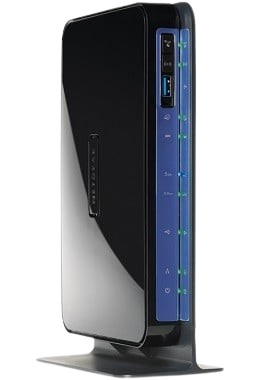

# OpenWrt 24.10 for Netgear DGND3700v2 — FIXED BOOT LOOP

<div align="center">

</div>

## Overview

This repository provides a stable and patched OpenWrt 24.10 firmware for the **Netgear DGND3700v2**, targeting the `bmips/bcm6362` platform.

> ⚠️ The official 24.10.1 release results in a boot loop on this device due to a known upstream bug. This build integrates the upstream fix (commit [3506efe](https://git.openwrt.org/?p=openwrt/openwrt.git;a=commitdiff;h=3506efe29c963cd6e021896fee09d060bb70b937)) to ensure successful boot and operation.

## Device Info

- **Model**: Netgear DGND3700v2  
- **SoC**: Broadcom BCM6362  
- **Target**: `bmips/bcm6362`  
- **Build Source**: OpenWrt 24.10
- **Config**: Based on [official build config](https://downloads.openwrt.org/releases/24.10.1/targets/bmips/bcm6362/config.buildinfo)

---

## ✅ What’s Included

- Patched `.bin` firmware image for direct installation
- Verified working boot behavior

---

## 🔧 Installation Instructions
 
[You can find the instructions here](https://openwrt.org/toh/netgear/dgnd3700_v2#installation_via_cfe_web_http_server)


---

## 🔐 Security and Verification

Before flashing, verify the firmware checksum:

```
SHA256: 8e53e9663909690a6ffbe410eb4f18a4c4dbcad851a561cdf0ee2d07ca55aa0f
```

This ensures integrity and authenticity of the firmware image.

---

## 📦 Releases

You can download the `.bin` firmware from the [Releases](../../releases) section.

---

## Disclaimer

Use at your own risk. This firmware is provided without any warranties. Always verify your device model and firmware compatibility before flashing.
